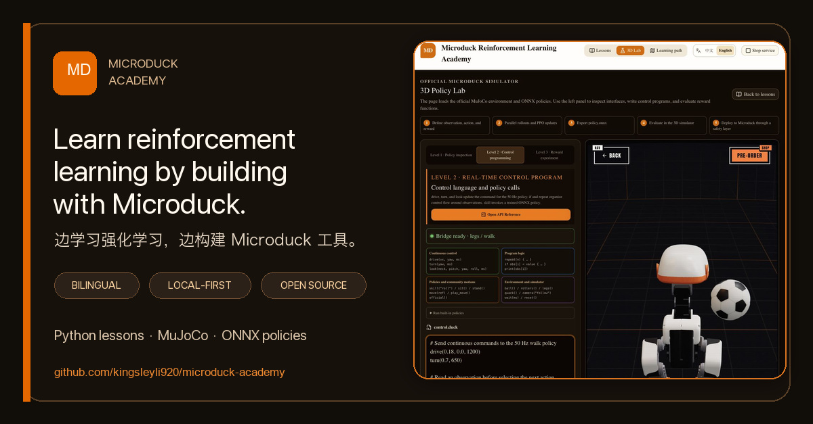
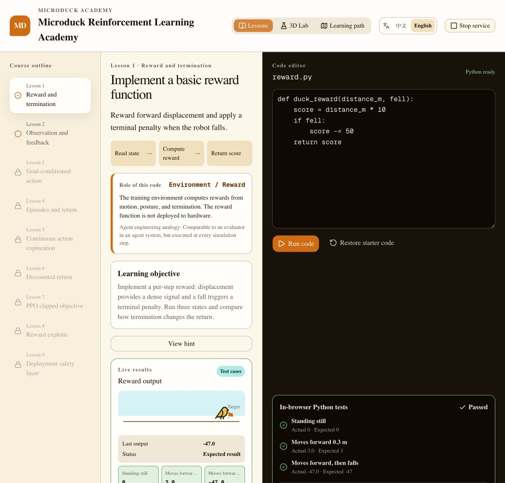
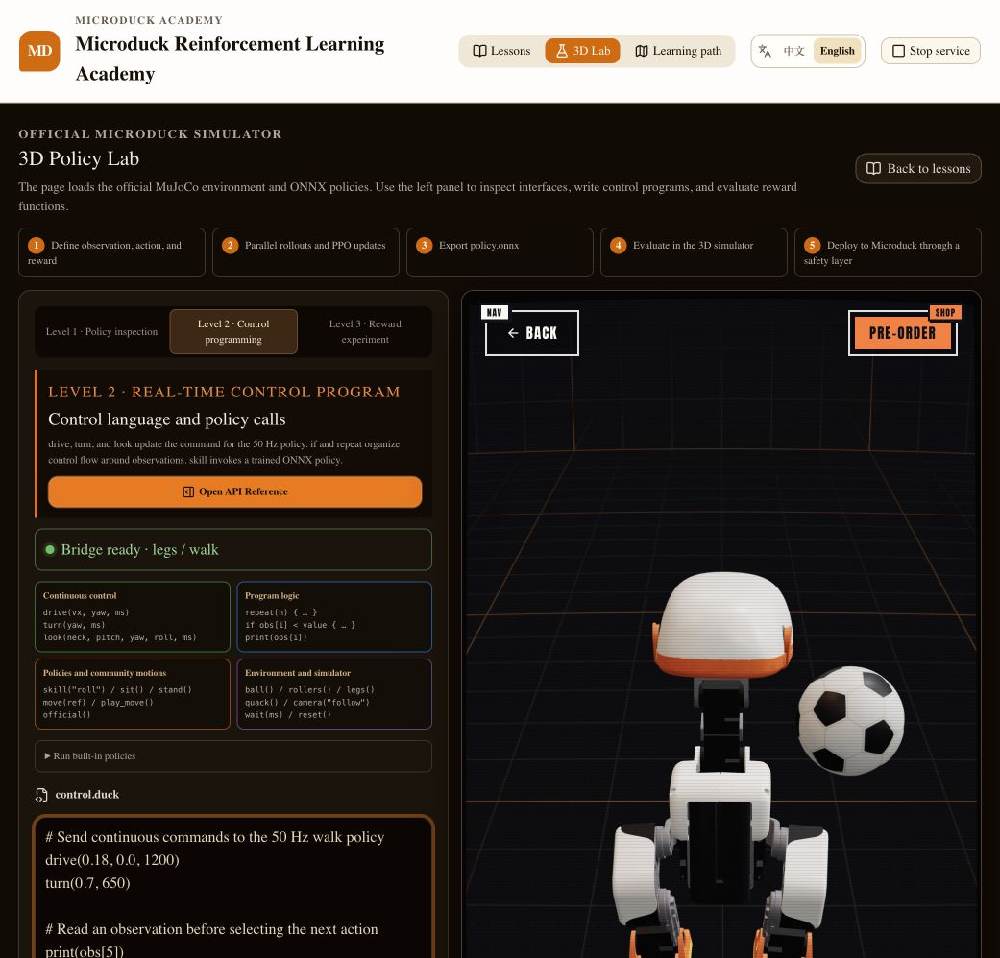

# Microduck Academy

[](https://github.com/kingsleyli920/microduck-academy/actions/workflows/ci.yml)
[](https://github.com/kingsleyli920/microduck-academy/releases)
[](LICENSE)

English · [中文](README.md)

A local-first, CodeCombat-style reinforcement learning classroom for developers learning with Microduck. Learners read a mission, write code, run browser-local tests, inspect real policy telemetry, and control the official MuJoCo + ONNX simulator from one page.



**Project status: public preview.** Levels 0–3 run in the local classroom. PPO training, ONNX export, and physical-device installation remain on the roadmap. See the [release status](docs/RELEASE_STATUS.md) for verified capability boundaries and [architecture](docs/ARCHITECTURE.md) for runtime and data boundaries.



## Quick start

Requirements: Node.js 22+, Git, and Git LFS.

```bash
git clone https://github.com/kingsleyli920/microduck-academy.git
cd microduck-academy
npm ci
npm run setup:runtime
npm run build
npm run academy
```

Open `http://localhost:3210`, select **3D Lab**, and run a `control.duck` program against the official ONNX policies.



## Current scope

- Level 0: nine guided lessons covering rewards, observations, actions, commands, rollouts, exploration, returns, PPO, reward hacking, and deployment safety
- Level 1: six experiments against the simulator's real 61D observation, 13D command, and 14D action contract
- Level 2: a bounded `control.duck` language with 25 documented API entries for continuous control, feedback logic, built-in skills, and compatible community moves
- Level 3: a Task & Reward Lab that evaluates two reward configurations with real MuJoCo rollouts and compares return, tracking error, action energy, and termination
- Chinese and English classroom UI, lessons, API Reference, and repository documentation
- Browser-local Python through Pyodide; progress stays in `localStorage` and can be exported as JSON

No account is required. The classroom does not record the screen or upload learner progress, code, or experiment history. See [PRIVACY.md](PRIVACY.md).

PPO training, ONNX publishing, and physical robot deployment are planned work. Level 3 evaluates an existing policy under configurable rewards; it does not update the ONNX weights. The current release is not a complete training or hardware platform.

## Run from source

Requirements: Node.js 22+, Git, and Git LFS.

```bash
npm ci
npm run setup:runtime
npm run verify
npm run academy
```

Open `http://localhost:3210`. The Stop button shuts down the local service.

The repository does not redistribute the official simulator, ONNX policies, robot models, or generated Pyodide runtime. `npm run setup:runtime` builds those local files from a pinned upstream checkout and the installed Pyodide package. See [THIRD_PARTY_NOTICES.md](THIRD_PARTY_NOTICES.md) and [the current release boundary](docs/RELEASE_STATUS.md).

## Contributing

See [CONTRIBUTING.md](CONTRIBUTING.md) for the development workflow, [SUPPORT.md](SUPPORT.md) for help, [the architecture](docs/ARCHITECTURE.md) for trust boundaries, [the control API](docs/CONTROL_API.md), [the project roadmap](docs/OPEN_SOURCE_ROADMAP.md), and [the maintainer guide](docs/MAINTAINER_GUIDE.md) for releases. Each page links to its Chinese counterpart.

Academy source is licensed under Apache-2.0. Microduck is a Pollen Robotics project; this independent classroom is not affiliated with or endorsed by Pollen Robotics or Hugging Face.
