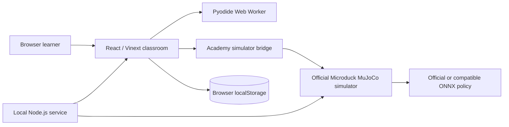

# Architecture

[简体中文](ARCHITECTURE.zh-CN.md) · English

Microduck Academy is a local-first learning application. Its own source is small; simulator and Python runtimes are generated locally and kept out of Git.

## Trust and data boundaries

- **Academy source:** React UI, lessons, the bounded `control.duck` parser, reward evaluation, local launcher, and documentation in this repository.
- **Generated local runtime:** Pyodide and the built official simulator under ignored `public/` paths. `npm run setup:runtime` creates these files from pinned inputs.
- **Browser data:** learner code, progress, control programs, Level 3 configurations, and aggregate results remain in `localStorage`. The Learning Path export is the explicit portability mechanism.
- **Upstream policy execution:** the official simulator owns MuJoCo stepping and ONNX inference. Academy reads exposed state and sends commands through a narrow browser bridge.
- **Untrusted community input:** external manifests and ONNX policies are user-selected inputs. They are not part of the Academy trust boundary.

## Learning levels

| Level | Runtime boundary | What changes |
| --- | --- | --- |
| 0 | Pyodide worker | Python functions and reinforcement learning concepts |
| 1 | Official simulator bridge | Observe the real 61D observation and 14D action contract |
| 2 | Official simulator bridge | Send commands or select an existing compatible policy |
| 3 | Official MuJoCo state | Score real rollouts with configurable reward and termination |
| 4–5 | Planned GPU training pipeline | Train a policy, evaluate it, and export ONNX |
| 6 | Planned physical device flow | Validate and install a policy on Microduck hardware |

Level 3 evaluates an existing policy. It does not perform gradient updates or rewrite ONNX weights.

## Runtime reproducibility

- Node.js major version is declared in `package.json` and `.nvmrc`.
- The official simulator commit and required Pyodide files are declared in `scripts/runtime-config.mjs`.
- `npm run check:release` prevents generated runtimes, common secrets, and personal absolute paths from entering Git.
- `npm run verify` runs release hygiene, tests, lint, TypeScript, and a production build.

Licensing and redistribution boundaries are documented in [THIRD_PARTY_NOTICES.md](../THIRD_PARTY_NOTICES.md).
