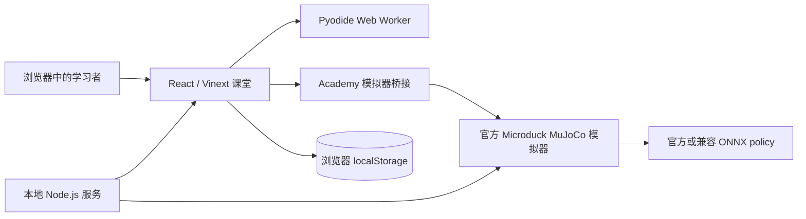

# 架构

[English](ARCHITECTURE.md) · 简体中文

Microduck Academy 是一个本地优先的学习应用。仓库只保存 Academy 自有源码；模拟器和 Python 运行时由安装脚本在本机生成，不进入 Git。

## 信任与数据边界

- 课程代码在 Pyodide Web Worker 中执行，不发送到远程服务。
- 学习进度、代码、Reward 配置和汇总指标保存在浏览器 `localStorage`。
- `control.duck` 使用受限语法，不执行任意 JavaScript。
- 嵌入模式在模拟器模块加载前关闭多人 WebSocket signaling，避免连接公共 relay 或广播姿态。
- 只有学习者执行 `move(ref)` 时才会读取外部 manifest 或 ONNX；这些内容属于不可信输入，必须通过上游加载器的兼容性检查。
- 官方模拟器构建产物、模型和资源不进入 Academy 仓库。

## 学习阶段

| Level | 系统边界 | 当前状态 |
| --- | --- | --- |
| 0 | 浏览器 Python 练习与测试 | 可用 |
| 1 | 读取官方模拟器 observation 和 action | 可用 |
| 2 | 向现有策略发送 command、调用 skill | 可用 |
| 3 | 使用 MuJoCo rollout 重新计算 reward | 可用 |
| 4 | PPO 训练和 checkpoint 评估 | 规划中 |
| 5 | ONNX 导出与发布 | 规划中 |
| 6 | 真机安装与安全验证 | 等待硬件 |

## 可复现运行时

`npm run setup:runtime` 使用 [runtime-config.mjs](../scripts/runtime-config.mjs) 中固定的模拟器提交和 Pyodide 版本生成本地运行时。`npm run check:runtime` 检查 manifest，`npm run verify` 运行发布检查、文档链接、测试、lint、类型检查和生产构建。

更新上游版本时，应在单独的 Pull Request 中修改固定提交，并重新验证官方测试、构建、浏览器启动、50 Hz 控制循环和受影响的 Academy 实验。
